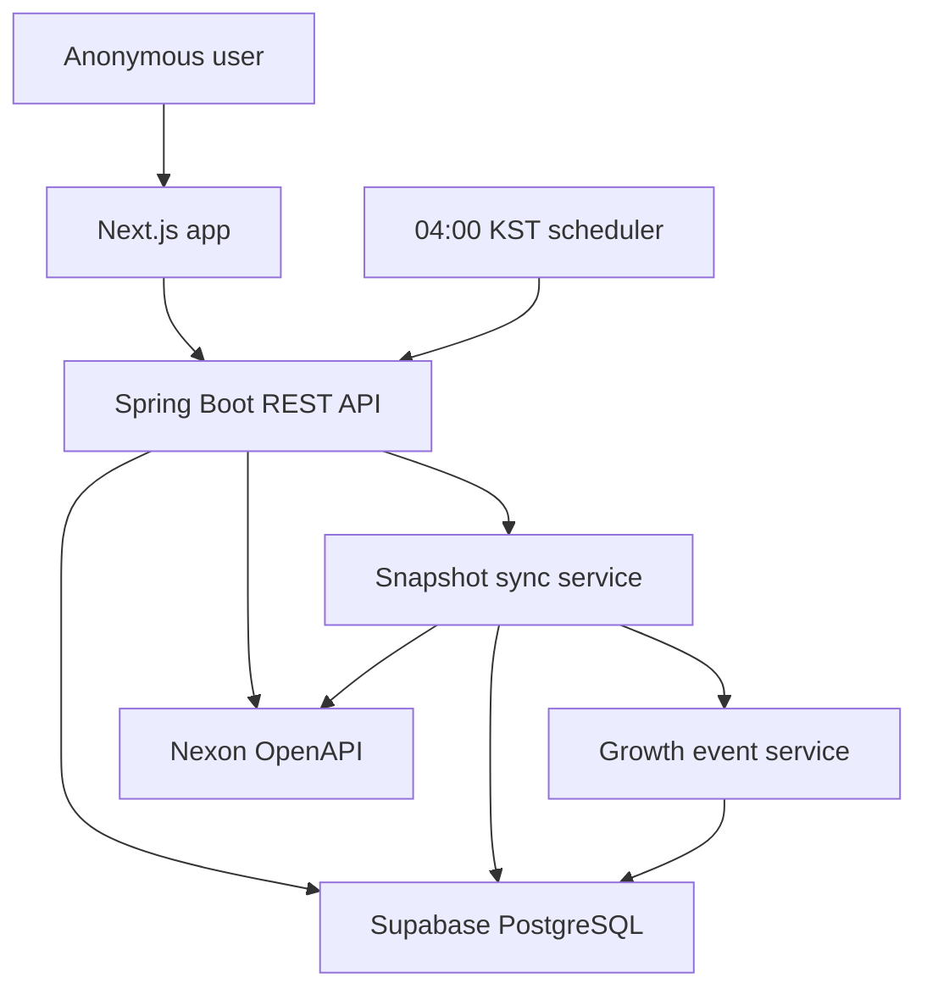
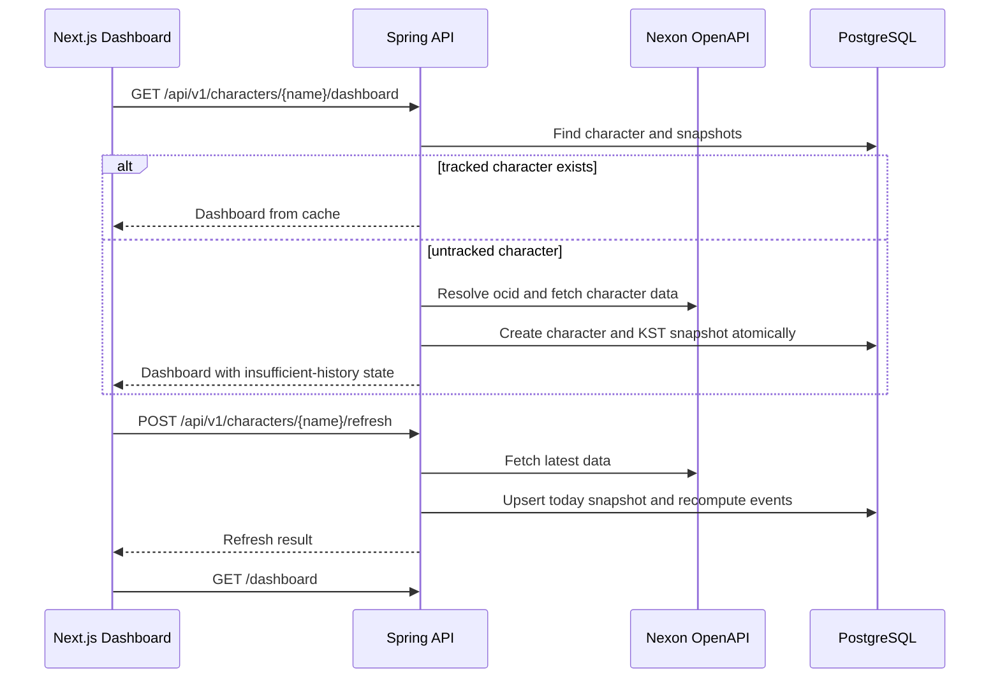

# feat: Build Maple Growth Tracker MVP

## Goal Capsule

| Field | Value |
| --- | --- |
| Objective | Build the Maple Growth Tracker MVP as a Spring Boot backend, Next.js frontend, and Supabase PostgreSQL-backed growth dashboard. |
| Authority | `doc/plans/mvp_requirements.md`, domain/API/UI/ops docs, then `database/schema.sql`; older broad UI or implementation notes are subordinate when they include deferred features. |
| Execution profile | Deep greenfield implementation with external API, persistence, scheduler, and UI state risks. |
| Stop conditions | Stop if Nexon API response fields cannot support required MVP metrics, if DB schema changes conflict with Supabase limits, or if implementation would require login, favorites, OpenGraph, detailed equipment diff, or admin surfaces. |
| Tail ownership | Implement units in dependency order, verify backend/domain behavior before frontend polish, and keep generated/dead-end scaffolding out of the final diff. |

---

## Product Contract

### Summary

Maple Growth Tracker lets an anonymous user search a MapleStory character nickname and view profile, current metrics, recent 7-day combat-power trend, and basic growth events.
The MVP proves the search-to-dashboard loop, daily KST snapshot persistence, failure-aware UI, and manual refresh.
It does not implement personalization, community ranking, OpenGraph, or detailed equipment comparison.

### Problem Frame

Users can see a character's current public MapleStory data, but the growth story is hard to reconstruct without a service that stores daily representative snapshots.
The MVP focuses on one public lookup flow and treats data history as derived from service-owned snapshots, not from same-day repeated fetches.

### Requirements

**Search and profile**

- R1. Users can search by character nickname from `/`.
- R2. A successful search routes to `/character/[name]`.
- R3. A DB miss reads from Nexon OpenAPI and stores the character when the external lookup succeeds.
- R4. Character-not-found and external API failures produce distinct recoverable UI states.
- R5. The dashboard shows nickname, world, job, level, EXP rate, and character image.
- R6. The dashboard shows combat power, union level, union artifact level, and HEXA matrix level sum when available.
- R7. The dashboard shows the last successful collection time.

**Snapshots and freshness**

- R8. First search and manual refresh create or update the character's KST daily representative snapshot.
- R9. A character has only one representative snapshot per KST date.
- R10. Same-date refresh updates the representative snapshot instead of appending a second row.
- R11. A newly registered character is auto-tracked by default.
- R12. Automatic snapshot collection runs at 04:00 KST for auto-tracked characters.
- R13. Snapshot date, "today", "recent 7 days", and freshness labels use `Asia/Seoul`.

**Charts and events**

- R14. The dashboard exposes a recent 7-day chart window.
- R15. Combat power is the MVP's primary chart metric.
- R16. Fewer than two comparable snapshots produces an explanatory empty chart/timeline state, not an error.
- R17. Events compare the current representative snapshot with the latest prior-date representative snapshot.
- R18. MVP event types are `LEVEL_UP`, `COMBAT_POWER_CHANGE`, `HEXA_UPGRADED`, and `UNION_UPGRADED`.
- R19. `ITEM_REPLACED` remains a stored/deferred type, but automatic equipment-diff generation and UI are out of scope.
- R20. Combat-power events use the threshold from `doc/domain/growth_event_rules.md`.
- R21. Reprocessing the same snapshot must not duplicate equivalent events.

**Refresh and failure**

- R22. The dashboard provides a manual refresh action.
- R23. Refresh success updates current metrics, freshness, chart data, and timeline data.
- R24. Refresh failure with cached data preserves the existing dashboard and shows a failure banner.
- R25. Refresh failure without cached data shows a full retryable error state.
- R26. Stored data is never hidden or deleted because Nexon OpenAPI fails.
- R27. Failed attempts do not update the last successful fetch time.

**UI states and access**

- R28. The main page keeps search focused and does not show recent-search chips or popular-character carousels in MVP.
- R29. The dashboard contains profile header, sync/refresh controls, summary metrics, combat-power chart, and event timeline.
- R30. Loading, empty, not-found, API failure, rate-limited, and mobile states are implemented.
- R31. Rising/falling values are not communicated by color alone.
- R32. The product remains anonymous and login-free.
- R33. A scheduler trigger does not start a second collection while another collection is active; it waits up to the configured limit and then skips without collecting duplicate snapshots.

### Key Flows

- F1. **First character search**
  - **Trigger:** A user submits a non-blank nickname from `/`.
  - **Steps:** Trim and validate nickname; call backend lookup; backend fetches Nexon data on DB miss; backend stores character and first KST snapshot in one transaction; frontend navigates to dashboard.
  - **Outcome:** The user sees profile/current metrics and data-insufficient chart/timeline states.
  - **Covered by:** R1, R2, R3, R5, R6, R8, R16, R30.
- F2. **Existing character dashboard**
  - **Trigger:** A user searches or opens `/character/[name]` for a tracked character.
  - **Steps:** Frontend fetches dashboard aggregate; backend reads DB snapshots/events; frontend renders profile, freshness, summary, chart, and timeline.
  - **Outcome:** Cached data renders without requiring a fresh Nexon call.
  - **Covered by:** R5, R6, R7, R14, R15, R17, R29.
- F3. **Manual refresh**
  - **Trigger:** A user clicks refresh on a dashboard.
  - **Steps:** Frontend disables the button; backend fetches Nexon data; backend upserts today's snapshot; backend recomputes derived MVP events; frontend refetches the dashboard.
  - **Outcome:** Existing dashboard remains visible during loading and updates after success.
  - **Covered by:** R10, R17, R21, R22, R23, R24.
- F4. **External API failure**
  - **Trigger:** Nexon lookup, refresh, or scheduler collection fails.
  - **Steps:** Backend maps the failure to the public error contract; successful cached data remains available; failed attempts do not overwrite success timestamps.
  - **Outcome:** UI shows not-found, retryable empty failure, or cached-data failure banner based on state.
  - **Covered by:** R4, R24, R25, R26, R27, R30.
- F5. **Automatic collection**
  - **Trigger:** The backend scheduler fires at 04:00 KST.
  - **Steps:** Acquire the process-local scheduler run guard; if another run is active, wait up to `APP_SCHEDULER_DUPLICATE_WAIT_SECONDS` and skip on timeout; otherwise select auto-tracked characters, process each in its own transaction, continue after per-character failure, and log counts without secrets or raw JSON.
  - **Outcome:** Daily representative snapshots and derived events are ready for future dashboards.
  - **Covered by:** R9, R10, R11, R12, R13, R17, R21, R33.

### Acceptance Examples

- AE1. **First lookup creates one daily snapshot**
  - **Given:** A valid untracked nickname exists in Nexon OpenAPI.
  - **When:** The user searches that nickname.
  - **Then:** One `characters` row and one KST `daily_snapshots` row exist, and the dashboard shows data-insufficient chart/timeline states.
  - **Covers:** R1, R3, R8, R9, R16.
- AE2. **Same-day refresh updates instead of appending**
  - **Given:** A character already has a snapshot for today's KST date.
  - **When:** The user refreshes successfully on the same KST date.
  - **Then:** The same snapshot row is updated, latest success time changes, and equivalent events are not duplicated.
  - **Covers:** R9, R10, R21, R23.
- AE3. **Cached dashboard survives API failure**
  - **Given:** A character has stored dashboard data.
  - **When:** Manual refresh receives a retryable Nexon failure.
  - **Then:** The existing dashboard remains visible, the refresh button exits loading, and a retryable failure banner appears.
  - **Covers:** R24, R26, R27, R30.
- AE4. **No data plus API failure does not create partial rows**
  - **Given:** A nickname is not stored locally.
  - **When:** Nexon returns not-found or retryable failure during first lookup.
  - **Then:** No partial character or snapshot row remains, and UI shows the matching not-found or retryable error state.
  - **Covers:** R3, R4, R25.
- AE5. **KST boundary controls snapshot date**
  - **Given:** The server runs outside KST.
  - **When:** A lookup happens near a local-system date boundary.
  - **Then:** `snapshot_date` uses `Asia/Seoul`, not the server timezone.
  - **Covers:** R9, R13.
- AE6. **Overlapping scheduler run is bounded and skipped**
  - **Given:** One automatic collection is already running and `APP_SCHEDULER_DUPLICATE_WAIT_SECONDS` is set to a positive value.
  - **When:** A second scheduler trigger fires.
  - **Then:** The second trigger waits no longer than the configured limit, performs no snapshot collection, and logs that it was skipped due to an active run.
  - **Covers:** R33.

### Scope Boundaries

### Deferred to Follow-Up Work

- Login, favorites, and "my characters".
- Popular or highlighted character carousel.
- OpenGraph image generation.
- Detailed equipment diff drawer and automatic `ITEM_REPLACED` generation.
- Admin collection dashboard.
- Durable retry queue, dead-letter handling, and long-term scheduler recovery.
- Multi-instance scheduler locking unless production launch requires horizontal backend scaling. Overlapping runs within one scheduler process use the bounded wait policy defined in the ops contract.

### Outside This MVP

- Boss, meso, node, and other events that cannot be reliably inferred from the current snapshot data.
- User-specific private account data.
- Real-time same-day growth history.

---

## Planning Contract

### Key Technical Decisions

- KTD1. **Source priority:** Treat `doc/plans/mvp_requirements.md`, `doc/domain/*`, `doc/api/api_contract.md`, `doc/ui/ui_states.md`, and `doc/ops/env_and_deployment.md` as the live MVP contract; use `doc/plans/implementation_plan.md` and `doc/ui/screen_design.md` only where they do not reintroduce deferred features. This prevents the older broad plan from pulling OpenGraph, equipment diff UI, popular carousel, or 30-day/all charts into the MVP.
- KTD2. **Greenfield roots:** Create `backend/` for Spring Boot and `frontend/` for Next.js, matching the planned project structure. The repo has no existing manifests or app code, so local code patterns do not constrain framework layout.
- KTD3. **Backend-only Nexon integration:** Call Nexon OpenAPI only from Spring Boot with `x-nxopen-api-key`; never call Nexon directly from the browser. This implements the secret boundary from `doc/ops/env_and_deployment.md` and follows Nexon OpenAPI's authentication contract.
- KTD4. **Read-through dashboard bootstrap:** Let `/character/[name]` bootstrap an untracked valid character through the same backend lookup/register flow as search. This makes shared or refreshed dashboard URLs work without adding a separate "register this character" UI.
- KTD5. **Cached dashboard first for tracked characters:** Existing dashboard loads from DB without requiring Nexon success. Manual refresh is the explicit live-sync action. This keeps the product usable during external API failures.
- KTD6. **Schema hardening before services:** Amend `database/schema.sql` before implementing services to add `daily_snapshots.captured_at`, `characters.last_sync_attempted_at`, `characters.last_sync_error_code`, `growth_event_logs.event_key`, and a unique event dedupe constraint. This closes freshness and duplicate-event gaps before code depends on ambiguous semantics.
- KTD7. **Unknown optional metrics stay unknown:** Store unavailable optional metrics as `null` instead of defaulting them to `0`. This prevents partial Nexon responses from creating false zero-value charts or false downgrade/change events.
- KTD8. **Events are derived data for a representative snapshot:** Recompute supported MVP event rows idempotently after each successful snapshot upsert. Same-day refresh may update or delete stale generated events for the same `snapshot_id`.
- KTD9. **Refresh returns lightweight result, frontend refetches dashboard:** Keep `POST /refresh` aligned with `doc/api/api_contract.md`, then refetch `GET /dashboard` after success. This avoids duplicating dashboard aggregation logic in the refresh response.
- KTD10. **Bounded scheduler overlap handling:** Use Spring `@Scheduled` with a six-field cron and `zone = "Asia/Seoul"` or equivalent property binding. If a run is already active, a subsequent trigger waits up to `APP_SCHEDULER_DUPLICATE_WAIT_SECONDS` (default 300 seconds), then skips without collecting duplicate snapshots. Values at or below zero are invalid. Cross-instance locking remains deferred unless production deployment requires horizontal scaling.
- KTD11. **Public frontend env values are build-visible:** Treat `NEXT_PUBLIC_API_BASE_URL` and `NEXT_PUBLIC_APP_TIMEZONE` as public values because Next.js inlines `NEXT_PUBLIC_` variables into browser bundles. No secret may use that prefix.

### High-Level Technical Design





### Output Structure

```text
backend/
  build.gradle.kts
  settings.gradle.kts
  src/main/java/com/maple/growth/
  src/main/resources/application.yml
  src/test/java/com/maple/growth/
frontend/
  package.json
  tsconfig.json
  app/
  components/
  lib/
  styles/
database/
  schema.sql
docs/plans/
  2026-08-02-001-feat-maple-growth-mvp-plan.md
```

### Assumptions

- A1. Java 21 is acceptable for the Spring Boot implementation; Java 17 remains viable if toolchain installation requires it.
- A2. Supabase is accessed through standard PostgreSQL JDBC from the backend, not through Supabase client libraries in the browser.
- A3. The MVP backend runs as one scheduler-owning instance in production.
- A4. Nexon OpenAPI fields for combat power, union, and HEXA data may be absent for some characters; missing fields are treated as unavailable metric data.
- A5. Tests can mock Nexon OpenAPI responses for deterministic backend verification.

### Sources and Research

- `doc/plans/mvp_requirements.md` defines product scope and R-IDs.
- `doc/domain/snapshot_policy.md` defines KST daily representative snapshot semantics.
- `doc/domain/growth_event_rules.md` defines event thresholds and duplicate prevention requirements.
- `doc/api/api_contract.md` defines REST response wrappers, error codes, and frontend state mapping.
- `doc/ui/ui_states.md` defines MVP loading, empty, error, refresh, mobile, and deferred UI behavior.
- `doc/ops/env_and_deployment.md` defines secret boundaries, env vars, scheduler defaults, and deployment checks.
- `database/schema.sql` is the executable DB starting point, but this plan hardens it before services depend on it.
- Nexon OpenAPI docs confirm the `x-nxopen-api-key` header, the MapleStory character endpoints, 30-day data-refresh obligation, and KMS data scope.
- Spring Framework docs confirm six-field cron expressions and `@Scheduled` timezone support through `zone`.
- Next.js docs confirm `NEXT_PUBLIC_` variables are bundled for browser access.
- Local learning corpus is absent under `docs/solutions/`; no repo-specific implementation precedent exists.

---

## Implementation Units

| Unit | Title | Key files | Depends on |
| --- | --- | --- | --- |
| U1 | Backend and frontend scaffolds | `backend/`, `frontend/` | None |
| U2 | Database schema hardening | `database/schema.sql`, backend entities | U1 |
| U3 | Nexon API client | backend config/service/dto tests | U1 |
| U4 | Snapshot sync workflow | backend services/repositories/tests | U2, U3 |
| U5 | Growth event engine | backend services/repositories/tests | U2, U4 |
| U6 | REST API contract | backend controllers/dto/tests | U4, U5 |
| U7 | Scheduler and ops config | backend scheduler/config/tests | U4, U5 |
| U8 | Frontend app shell and API client | frontend app/lib/tests | U1, U6 |
| U9 | Dashboard UI states | frontend components/styles/tests | U8 |
| U10 | Integration docs and smoke verification | README/env docs | U1-U9 |

### U1. Backend and frontend scaffolds

- **Goal:** Create the executable Spring Boot and Next.js project skeletons without implementing domain behavior yet.
- **Requirements:** Enables R1-R32 implementation.
- **Dependencies:** None.
- **Files:**
  - `backend/settings.gradle.kts`
  - `backend/build.gradle.kts`
  - `backend/src/main/java/com/maple/growth/MapleGrowthApplication.java`
  - `backend/src/main/resources/application.yml`
  - `backend/src/test/java/com/maple/growth/MapleGrowthApplicationTests.java`
  - `frontend/package.json`
  - `frontend/tsconfig.json`
  - `frontend/next.config.ts`
  - `frontend/app/layout.tsx`
  - `frontend/app/page.tsx`
  - `frontend/styles/globals.css`
- **Approach:**
  1. Use Spring Boot 3.x with WebFlux/WebClient, Spring MVC or WebFlux controller support, Spring Data JPA, PostgreSQL driver, validation, and test dependencies.
  2. Use Next.js App Router with TypeScript and CSS Modules or a simple project-level style structure.
  3. Keep local secret files ignored and provide example-only env documentation in U10.
- **Execution note:** This is mostly packaging/config; prove it with install/build smoke checks before adding domain complexity.
- **Patterns to follow:** `doc/plans/implementation_plan.md` folder layout and `.gitignore` existing Java/Node ignores.
- **Test scenarios:**
  - Spring application context starts with test-safe placeholder config and no real Nexon API key.
  - Frontend root page renders a minimal search shell without requiring backend availability.
  - Build outputs and dependency folders remain ignored by Git.
- **Verification:** Backend and frontend scaffold commands complete locally, and no secret placeholders are required for default test startup.

### U2. Database schema hardening

- **Goal:** Make the SQL schema match snapshot freshness, optional metric, and event idempotency semantics before application code relies on it.
- **Requirements:** R8-R13, R17-R21, R26-R27.
- **Dependencies:** U1.
- **Files:**
  - `database/schema.sql`
  - `doc/db/schema_design.md`
  - `backend/src/main/java/com/maple/growth/entity/CharacterEntity.java`
  - `backend/src/main/java/com/maple/growth/entity/DailySnapshotEntity.java`
  - `backend/src/main/java/com/maple/growth/entity/GrowthEventLogEntity.java`
  - `backend/src/test/java/com/maple/growth/repository/DailySnapshotRepositoryTest.java`
  - `backend/src/test/java/com/maple/growth/repository/GrowthEventLogRepositoryTest.java`
- **Approach:**
  1. Add `characters.last_sync_attempted_at` and `characters.last_sync_error_code` for durable sync-attempt state.
  2. Add `daily_snapshots.captured_at` for the time the representative values were most recently captured.
  3. Allow optional metric columns to represent unknown data where product rules require metric-level disabling.
  4. Add `growth_event_logs.event_key` and a unique constraint such as `(snapshot_id, event_type, event_key)`.
  5. Align `doc/db/schema_design.md` with the executable SQL and remove or replace stale non-portable legacy file links if touched.
- **Patterns to follow:** Existing snake_case DB naming in `database/schema.sql`; camelCase mapping at DTO boundaries only.
- **Test scenarios:**
  - Inserting two snapshots for one character and one KST date violates or upserts against the unique daily snapshot rule.
  - A growth event with identical `snapshot_id`, `event_type`, and `event_key` cannot be inserted twice.
  - Nullable optional metrics can be persisted as unknown without being coerced to `0`.
  - `captured_at`, `last_sync_attempted_at`, and `last_sync_error_code` map to timezone-aware Java types.
- **Verification:** SQL initializes on PostgreSQL-compatible test database, JPA mappings match table/column names, and repository tests prove uniqueness/nullability assumptions.

### U3. Nexon API client

- **Goal:** Encapsulate Nexon OpenAPI access behind a backend-only client with typed internal DTOs and public error mapping.
- **Requirements:** R3, R4, R5, R6, R25-R27.
- **Dependencies:** U1.
- **Files:**
  - `backend/src/main/java/com/maple/growth/config/NexonApiProperties.java`
  - `backend/src/main/java/com/maple/growth/config/WebClientConfig.java`
  - `backend/src/main/java/com/maple/growth/service/NexonApiClient.java`
  - `backend/src/main/java/com/maple/growth/dto/nexon/*`
  - `backend/src/main/java/com/maple/growth/service/NexonApiException.java`
  - `backend/src/test/java/com/maple/growth/service/NexonApiClientTest.java`
- **Approach:**
  1. Resolve OCID through `/maplestory/v1/id` using the submitted nickname.
  2. Fetch only MVP-required character profile/stat/equipment/HEXA/union-related data needed to populate snapshot and raw JSON fields.
  3. Send `x-nxopen-api-key` from backend config only.
  4. Map Nexon not-found, rate-limit, maintenance, data-preparing, and generic failures to internal retryable/non-retryable exception types used by U6.
  5. Never log API key or full raw response payloads.
- **Execution note:** Start with mocked HTTP tests for response-to-domain mapping before wiring the sync workflow.
- **Patterns to follow:** `doc/ops/env_and_deployment.md` env names; `doc/api/api_contract.md` public error code vocabulary.
- **Test scenarios:**
  - Successful nickname lookup sends `x-nxopen-api-key` and parses OCID.
  - Korean nickname is URL-encoded and not double-encoded.
  - Nexon not-found-like response maps to non-retryable `CHARACTER_NOT_FOUND`.
  - Nexon 429 maps to retryable `RATE_LIMITED`.
  - Nexon 500/503 or maintenance maps to retryable upstream failure/unavailable.
  - Missing optional metric fields remain unknown for downstream snapshot creation.
- **Verification:** Client tests cover success, not-found, rate-limit, maintenance/unavailable, malformed response, timeout, and no-secret logging behavior.

### U4. Snapshot sync workflow

- **Goal:** Implement atomic character registration, snapshot upsert, freshness tracking, and cached-data preservation.
- **Requirements:** R3, R7-R13, R22-R27, AE1-AE5.
- **Dependencies:** U2, U3.
- **Files:**
  - `backend/src/main/java/com/maple/growth/service/CharacterLookupService.java`
  - `backend/src/main/java/com/maple/growth/service/SnapshotSyncService.java`
  - `backend/src/main/java/com/maple/growth/service/KstClock.java`
  - `backend/src/main/java/com/maple/growth/repository/CharacterRepository.java`
  - `backend/src/main/java/com/maple/growth/repository/DailySnapshotRepository.java`
  - `backend/src/test/java/com/maple/growth/service/SnapshotSyncServiceTest.java`
  - `backend/src/test/java/com/maple/growth/service/KstClockTest.java`
- **Approach:**
  1. Trim and validate nickname at service boundary.
  2. For untracked characters, fetch Nexon data and create character plus first snapshot in one transaction.
  3. For tracked characters, return cached dashboard inputs without requiring a Nexon call.
  4. For manual refresh and scheduler collection, fetch Nexon data and upsert the current KST daily snapshot.
  5. Update `captured_at`, `last_fetched_at`, `last_sync_attempted_at`, and `last_sync_error_code` according to success/failure semantics.
  6. Roll back character/snapshot creation if a first lookup cannot complete required Nexon fetches.
- **Technical design:** Directional flow: `lookupOrRegister(name)` chooses cached DB path when data exists; otherwise it calls `syncFromNexon(name, reason=FIRST_LOOKUP)` inside a transaction and returns dashboard inputs after commit.
- **Patterns to follow:** `doc/domain/snapshot_policy.md` S1-S51.
- **Test scenarios:**
  - First search success creates character, first KST snapshot, `is_auto_track=true`, and success timestamps.
  - First search not-found creates no character or snapshot.
  - First search retryable failure creates no partial rows.
  - Existing character dashboard read does not call Nexon.
  - Same KST date refresh updates one snapshot row and does not append.
  - Previous-date snapshots are not modified by same-day refresh.
  - Server default timezone outside KST still creates the correct `snapshot_date`.
  - Failed refresh with existing data records attempted/error state but does not update `last_fetched_at`.
- **Verification:** Service tests prove transactional first registration, KST date handling, same-day upsert, stale/cached behavior, and failure preservation.

### U5. Growth event engine

- **Goal:** Generate and maintain MVP growth events from representative snapshot comparisons.
- **Requirements:** R17-R21, AE2.
- **Dependencies:** U2, U4.
- **Files:**
  - `backend/src/main/java/com/maple/growth/service/GrowthEventService.java`
  - `backend/src/main/java/com/maple/growth/domain/GrowthEventType.java`
  - `backend/src/main/java/com/maple/growth/repository/GrowthEventLogRepository.java`
  - `backend/src/test/java/com/maple/growth/service/GrowthEventServiceTest.java`
- **Approach:**
  1. Compare the current snapshot only with the latest prior-date snapshot.
  2. Skip event generation when no prior-date snapshot exists.
  3. Generate `LEVEL_UP`, `COMBAT_POWER_CHANGE`, `HEXA_UPGRADED`, and `UNION_UPGRADED` only.
  4. Build deterministic `event_key` values from the stable detail keys in `doc/domain/growth_event_rules.md`.
  5. On representative snapshot update, replace the generated MVP event set for that snapshot inside the same transaction or use upsert/delete semantics that remove stale generated events.
  6. Do not generate `ITEM_REPLACED` in MVP even when equipment raw JSON changes.
- **Technical design:** Directional flow: `recomputeEvents(snapshot)` loads prior snapshot, calculates desired MVP event rows, removes generated rows for this snapshot that are no longer desired, and upserts desired rows by `(snapshot_id, event_type, event_key)`.
- **Patterns to follow:** `doc/domain/growth_event_rules.md` E1-E55.
- **Test scenarios:**
  - First snapshot creates no events.
  - Level increase creates one `LEVEL_UP` event with importance 3.
  - Combat power delta exactly `100000` creates a change event.
  - Combat power delta below threshold creates no event.
  - Combat power delta exactly `1.0%` creates a change event.
  - Previous combat power `0` uses absolute threshold only.
  - Large combat-power change sets importance 2.
  - HEXA sum increase creates one `HEXA_UPGRADED` event.
  - Union level and artifact increase in the same snapshot merge into one `UNION_UPGRADED` event.
  - Missing optional metrics skip only that metric's event.
  - Recomputing the same snapshot twice does not duplicate rows.
  - Same-day snapshot update removes or updates stale generated rows.
  - Equipment raw JSON changes do not create `ITEM_REPLACED`.
- **Verification:** Domain tests cover every threshold, duplicate key, missing metric, and stale-row recomputation rule.

### U6. REST API contract

- **Goal:** Expose the MVP backend through the JSON contract that the frontend can implement against without guessing states.
- **Requirements:** R1-R7, R14-R16, R22-R27, R30, AE1-AE4.
- **Dependencies:** U4, U5.
- **Files:**
  - `backend/src/main/java/com/maple/growth/controller/CharacterController.java`
  - `backend/src/main/java/com/maple/growth/dto/api/*`
  - `backend/src/main/java/com/maple/growth/config/ApiExceptionHandler.java`
  - `backend/src/test/java/com/maple/growth/controller/CharacterControllerTest.java`
- **Approach:**
  1. Implement `GET /api/v1/characters/{name}` as lookup/register plus profile/latest/sync response.
  2. Implement `GET /api/v1/characters/{name}/dashboard` as the default dashboard aggregate and read-through bootstrap for unknown valid characters.
  3. Implement `GET /api/v1/characters/{name}/growth-history?range=7d`.
  4. Implement `GET /api/v1/characters/{name}/events?limit=20`.
  5. Implement `POST /api/v1/characters/{name}/refresh`.
  6. Wrap all responses in `success/data/meta` or `success/error/meta`.
  7. Return HTTP 200 for data-insufficient dashboard states.
  8. Validate unsupported `range`, invalid `limit`, and blank names with 400 responses.
- **Execution note:** Start with controller contract tests using mocked services, then connect to service integration tests.
- **Patterns to follow:** `doc/api/api_contract.md` A1-A8 and API acceptance criteria.
- **Test scenarios:**
  - `GET /characters/{name}` success includes `profile`, `latestSnapshot`, `syncState`, and `meta.timezone=Asia/Seoul`.
  - `GET /dashboard` with one snapshot returns HTTP 200 and `summary.hasEnoughSnapshots=false`.
  - `GET /growth-history?range=7d` returns existing points only and no synthetic zero points.
  - Unsupported `range=30d` or `range=all` returns a clear 400 until enabled.
  - `GET /events?limit=20` returns latest-first events and `hasMore`/`nextCursor`.
  - `POST /refresh` success returns created/updated snapshot flags and created event count.
  - `CHARACTER_NOT_FOUND` returns 404 with `retryable=false`.
  - Nexon rate limit returns 429 with `retryable=true`.
  - Nexon unavailable returns 503 with `retryable=true`.
  - All responses include `meta.serverTime` and `meta.timezone`.
- **Verification:** Contract tests assert wrapper shape, HTTP statuses, error codes, retryability, data-insufficient semantics, and dashboard aggregate shape.

### U7. Scheduler and ops config

- **Goal:** Add automatic 04:00 KST snapshot collection and bounded overlap handling without introducing multi-instance locking complexity.
- **Requirements:** R11-R13, R17-R21, R26-R27.
- **Dependencies:** U4, U5.
- **Files:**
  - `backend/src/main/java/com/maple/growth/scheduler/DailySnapshotScheduler.java`
  - `backend/src/main/java/com/maple/growth/config/AppProperties.java`
  - `backend/src/main/resources/application.yml`
  - `backend/src/test/java/com/maple/growth/scheduler/DailySnapshotSchedulerTest.java`
  - `doc/ops/env_and_deployment.md`
- **Approach:**
  1. Bind `APP_TIMEZONE`, `APP_SNAPSHOT_CRON`, `APP_SCHEDULER_DUPLICATE_WAIT_SECONDS`, CORS, Nexon URL, and timeout settings.
  2. Use Spring scheduling with a 04:00 KST cron and timezone-aware execution.
  3. Bind the overlap wait setting into `AppProperties`, default it to 300 seconds, and fail application startup for non-positive values.
  4. Guard the scheduler method with a process-local lock; a contending trigger waits up to the configured limit and then returns without snapshot collection.
  5. Select only `is_auto_track=true` characters after acquiring the guard.
  6. Process each character independently so one failure does not stop the batch.
  7. Log batch start/end, target count, success count, failure count, and overlap skips without secrets or raw JSON.
  8. Test lock release after success and after batch failure, plus timeout-based skip without invoking `SnapshotSyncService`.
  9. Document that cross-instance locking remains deferred unless horizontal scaling is enabled.
- **Patterns to follow:** `doc/ops/env_and_deployment.md` O11-O34 and Spring's six-field cron semantics.
- **Test scenarios:**
  - Scheduler uses `Asia/Seoul` for the configured trigger.
  - An overlapping trigger waits for the active run and skips after the configured limit.
  - The default overlap wait is 300 seconds and non-positive values are rejected.
  - The run guard is released when the active collection exits, including unexpected batch-level failure.
  - A timeout-based skip does not query or refresh characters.
  - Scheduler selects auto-tracked characters only.
  - One character failure does not prevent later characters from syncing.
  - Failed scheduler sync does not update `last_fetched_at`.
  - Logs include counts and omit Nexon API key/raw response body.
  - Setting the cron to disabled value or test override can prevent accidental scheduler execution in tests.
- **Verification:** Scheduler tests prove selection, partial failure continuation, timestamp semantics, and config binding.

### U8. Frontend app shell and API client

- **Goal:** Build the Next.js search route, dashboard route bootstrap, and typed backend API client.
- **Requirements:** R1-R4, R28, R30, R32, F1-F4.
- **Dependencies:** U1, U6.
- **Files:**
  - `frontend/app/page.tsx`
  - `frontend/app/character/[name]/page.tsx`
  - `frontend/lib/api/client.ts`
  - `frontend/lib/api/types.ts`
  - `frontend/lib/format.ts`
  - `frontend/__tests__/search-page.test.tsx`
  - `frontend/__tests__/api-client.test.ts`
- **Approach:**
  1. Model the backend wrapper and DTOs in TypeScript.
  2. Keep only `NEXT_PUBLIC_API_BASE_URL` and `NEXT_PUBLIC_APP_TIMEZONE` as public env reads.
  3. Trim search input, disable blank submit, prevent duplicate submit, and navigate by URL-encoded name.
  4. Let `/character/[name]` fetch the dashboard aggregate and render state-specific children from U9.
  5. Preserve current input on not-found and retryable search failures.
- **Execution note:** Implement API-client behavior with mocked fetch responses before styling the UI.
- **Patterns to follow:** `doc/ui/ui_states.md` U7-U23 and Next.js App Router conventions.
- **Test scenarios:**
  - Empty search button is disabled.
  - Whitespace-only search does not submit.
  - Input is trimmed before navigation.
  - Korean nickname is encoded in the route and decoded for API calls.
  - Pending search disables duplicate submit.
  - API client maps success and error wrapper shapes without throwing away retryability.
  - No frontend code reads `NEXON_API_KEY` or DB credentials.
- **Verification:** Frontend tests prove search validation, API-client mapping, public env boundaries, and route bootstrap behavior.

### U9. Dashboard UI states

- **Goal:** Render the MVP dashboard and all required loading, empty, failure, refresh, mobile, and accessibility states.
- **Requirements:** R5-R7, R14-R16, R22-R24, R28-R31, AE1-AE3.
- **Dependencies:** U8.
- **Files:**
  - `frontend/components/ProfileHeader.tsx`
  - `frontend/components/SyncStatus.tsx`
  - `frontend/components/SummaryCards.tsx`
  - `frontend/components/CombatPowerChart.tsx`
  - `frontend/components/EventTimeline.tsx`
  - `frontend/components/StateMessage.tsx`
  - `frontend/styles/dashboard.module.css`
  - `frontend/__tests__/dashboard-page.test.tsx`
  - `frontend/__tests__/dashboard-states.test.tsx`
- **Approach:**
  1. Render profile, sync status, summary, combat-power chart, and timeline in the MVP order from `doc/ui/ui_states.md`.
  2. Show loading skeletons per major dashboard area on first load.
  3. During manual refresh, keep dashboard content visible and only put the refresh control into loading state.
  4. After refresh success, refetch dashboard per KTD9.
  5. Use explanatory empty states for one snapshot, insufficient chart points, and no events.
  6. Show cached-data failure banner when a refresh fails with existing data.
  7. Hide or disable 30-day/all ranges, recent-search chips, popular carousel, and equipment diff UI.
  8. Ensure mobile layout avoids overlap and rising/falling values include text or signs beyond color.
- **Patterns to follow:** `doc/ui/ui_states.md`; `doc/ui/screen_design.md` only where it does not conflict with MVP exclusions.
- **Test scenarios:**
  - First dashboard load shows area-level loading states, not a blank screen.
  - One-snapshot dashboard shows profile/current metrics and data-insufficient chart/timeline messages.
  - Two-snapshot dashboard shows combat-power chart and events.
  - Empty event list with enough snapshots shows "no detected events" rather than "data insufficient".
  - Refresh loading disables only the refresh button and preserves dashboard content.
  - Refresh failure with cached data shows banner and keeps prior profile/chart/timeline.
  - `CHARACTER_NOT_FOUND` renders distinct not-found UI.
  - `RATE_LIMITED` renders calm retry guidance.
  - Mobile viewport keeps search, profile, summary, chart, and timeline readable.
  - Rising/falling values include signs or direction text.
- **Verification:** Component/page tests cover all UI-state acceptance criteria and a browser smoke pass confirms responsive layout.

### U10. Integration docs and smoke verification

- **Goal:** Make the MVP runnable by a future implementer/operator and document the first local verification path.
- **Requirements:** R1-R32 and ops acceptance criteria.
- **Dependencies:** U1-U9.
- **Files:**
  - `README.md`
  - `backend/.env.example`
  - `frontend/.env.example`
  - `doc/ops/env_and_deployment.md`
  - `docs/plans/2026-08-02-001-feat-maple-growth-mvp-plan.md`
- **Approach:**
  1. Add a README that points to product, domain, API, UI, ops, and implementation-plan docs.
  2. Provide example env files with placeholders only.
  3. Document local DB setup with `database/schema.sql`.
  4. Document the smoke path: backend starts, frontend starts, user searches a character, dashboard displays current data or a well-formed failure state.
  5. Keep real secrets out of committed docs and examples.
- **Execution note:** This unit is documentation and smoke oriented; prefer runtime smoke evidence over additional unit tests.
- **Patterns to follow:** `doc/ops/env_and_deployment.md` deployment checklist.
- **Test scenarios:**
  - Example env files contain placeholders and no real secret-looking values.
  - README links to the MVP requirements, API contract, UI states, ops doc, and implementation plan.
  - Local setup steps mention backend-only Nexon API key and frontend-only public API base URL.
  - Smoke verification covers successful search when credentials exist and graceful error when credentials/API are unavailable.
- **Verification:** A fresh reader can identify required env vars, DB setup, startup order, and MVP smoke route from README and examples.

---

## Verification Contract

| Gate | Applies to | Done signal |
| --- | --- | --- |
| Backend unit and integration tests | U2-U7 | Repository, service, controller, scheduler, and config tests pass with mocked Nexon API. |
| Frontend tests | U8-U9 | Search, API client, dashboard state, refresh, and accessibility-oriented rendering tests pass. |
| DB schema initialization | U2 | `database/schema.sql` applies cleanly to PostgreSQL/Supabase-compatible database and supports JPA mappings. |
| API contract smoke | U6-U9 | `GET /api/v1/characters/{name}`, `GET /dashboard`, and `POST /refresh` return the documented wrapper shapes. |
| KST boundary proof | U4, U7 | Tests prove `snapshot_date` and scheduler behavior use `Asia/Seoul` independent of server timezone. |
| Secret boundary proof | U3, U8, U10 | Nexon API key and DB credentials exist only in backend/server env surfaces and are absent from frontend public env/test bundles. |
| Manual smoke | U10 | Local frontend can search a nickname and render either dashboard data or a correct not-found/retryable failure state. |

---

## Definition of Done

- D1. `backend/` and `frontend/` are executable project roots with documented local setup.
- D2. `database/schema.sql` matches the implemented entity model and closes freshness, optional metric, and event-dedupe gaps.
- D3. Nexon API key and Supabase credentials are never exposed to frontend code or public env names.
- D4. First search can create a character plus first KST snapshot atomically.
- D5. Existing dashboard data can render without a successful Nexon call.
- D6. Same-day refresh updates one representative snapshot row and recomputes derived MVP events idempotently.
- D7. Automatic collection runs at 04:00 KST for auto-tracked characters and continues after per-character failures.
- D8. REST endpoints return the documented success/error wrappers, statuses, retryability, and `Asia/Seoul` metadata.
- D9. Frontend implements required search, loading, empty, failure, refresh, mobile, and accessibility states.
- D10. MVP-deferred features remain absent or disabled.
- D11. Backend, frontend, DB, and smoke verification gates in the Verification Contract pass.
- D12. Abandoned scaffold experiments, unused generated files, and dead-end code are removed before landing.

---

## Risks and Dependencies

| Risk | Impact | Mitigation |
| --- | --- | --- |
| Nexon API field availability differs from assumptions | Required metrics may be missing or named differently. | Keep U3 client isolated, store raw JSON, and use nullable optional metrics with tests for missing fields. |
| Event dedupe is easy to get wrong | Same-day refresh or reruns can duplicate or stale timeline rows. | Add DB-level `event_key` uniqueness and recompute derived rows transactionally in U5. |
| KST date bugs corrupt history | Snapshots can land on wrong dates near midnight. | Centralize KST clock logic and test server-timezone-independent boundaries in U4. |
| Scheduler duplicates in scaled deployment | Multiple backend instances could collect twice. | MVP assumes one scheduler instance; add DB lock before scaling horizontally. |
| Frontend accidentally exposes secrets | API key leakage would be high impact. | Make the backend the only Nexon caller and test/scan frontend env usage. |
| Older docs show deferred UI | Implementation can drift into non-MVP work. | KTD1 sets source priority; U9 tests hide/defer non-MVP UI. |

---

## Operational Notes

- Nexon attribution text from the OpenAPI terms should be included in the UI or footer before public launch: "Data based on NEXON Open API" or equivalent approved wording.
- Nexon notes say pulled data must be updated at least every 30 days; the 04:00 KST scheduler satisfies this for auto-tracked characters when it runs successfully.
- Logs must include collection counts and failure classes, not raw JSON payloads or secrets.
- If the deployment target sleeps or stops scheduled processes, use an external trigger or choose a backend host that keeps the scheduler alive.
