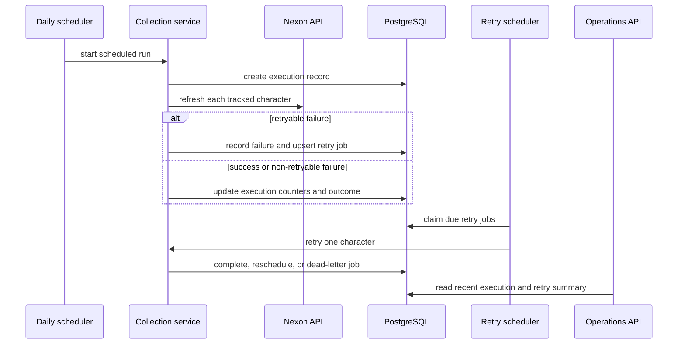

# feat: Add collection retry and operations visibility

## Goal Capsule

| Field | Value |
| --- | --- |
| Objective | Make scheduled collection failures traceable and recoverable without losing cached character data. |
| Authority | Existing MVP behavior and failure rules remain authoritative; this plan implements the previously deferred retry queue, dead-letter handling, and minimal operations API. |
| Execution profile | Standard backend, schema, scheduler, and public API work with external Nexon failure handling. |
| Stop conditions | Stop if a change would require exposing raw Nexon payloads, end-user accounts, an admin UI, or cross-instance scheduler locking. |
| Tail ownership | Deliver database schema, domain behavior, API contract, environment documentation, and focused tests in dependency order. |

---

## Product Contract

### Summary

The current daily scheduler logs per-character failures but does not retain a batch execution record or a durable recovery path.
This follow-up adds a database-backed retry lifecycle for retryable scheduled-collection failures and a read-only operations API for inspecting recent collection health.
Manual refresh continues to return its existing user-facing error contract and does not enqueue background work.

### Problem Frame

An upstream Nexon outage, rate limit, or transient network failure can leave an auto-tracked character stale until the next daily run.
Operations also cannot tell whether a batch was skipped, partially failed, completed after retries, or exhausted its retry budget without searching application logs.

### Requirements

- R1. Every scheduled collection trigger records one execution outcome: completed, partially failed, failed before character processing, or skipped because an in-process run is active.
- R2. A retryable failure while collecting an existing auto-tracked character creates or updates one durable retry job for that character instead of creating duplicate pending work.
- R3. Non-retryable failures are recorded in execution history and character sync state but are never queued for retry.
- R4. Retry processing claims only due pending jobs, records each attempt, and changes the job to succeeded, pending with a later due time, or dead-lettered after the configured maximum attempts.
- R5. Retry attempts use the existing snapshot upsert and event recomputation behavior, so same-day retries do not create duplicate snapshots or growth events.
- R6. A failed retry never overwrites a character's last successful fetch time or removes cached dashboard data.
- R7. A read-only operations endpoint exposes recent execution summaries and retry/dead-letter counts only to callers presenting the configured operations token; it never returns raw Nexon JSON, API keys, stack traces, or user credentials.
- R8. Retry cadence, batch size, maximum attempts, and initial backoff are environment-configurable and validated at startup.
- R9. Existing anonymous character-search and manual-refresh API behavior remains unchanged.

### Acceptance Examples

- AE1. When a scheduled collection receives a retryable Nexon failure for one character, the batch continues, the run is marked partially failed, and one retry job becomes due after the configured delay.
- AE2. When a retry succeeds, its job is completed, the character's last successful fetch time advances, and the original run can be inspected as recovered without duplicate same-day data.
- AE3. When retries exhaust their maximum attempt count, the job remains inspectable as dead-lettered and future polling does not call Nexon for it again.
- AE4. When a manual refresh fails, cached data and the existing public failure response remain intact, and no background retry job is created.
- AE5. When an overlapping scheduled trigger is skipped, operations can see that skip separately from a successful empty batch.

### Scope Boundaries

**Included:** scheduled-collection execution history, durable retry/dead-letter state, retry polling, a token-protected read-only operations API, configuration, tests, and operations/API documentation.

**Deferred to Follow-Up Work:** authenticated administration UI, operator-triggered replay endpoints, alert delivery, external observability integration, retention/archiving policy, and cross-instance scheduler leadership or distributed locks.

---

## Planning Contract

### Key Technical Decisions

- KTD1. Store execution and retry state in PostgreSQL rather than an in-memory collection or a new queue service. This survives restarts, fits the existing Supabase-backed deployment, and avoids introducing infrastructure before volume justifies it. (session-settled: user-directed - chosen over broader product expansion because operational stability is the immediate priority.)
- KTD2. Queue only retryable failures from scheduled and retry-triggered collection. Manual refresh remains explicit and synchronous, preserving the MVP's current user expectations.
- KTD3. Treat each retry as a new attempt of the same logical job, with bounded backoff and a terminal dead-letter state. Keep error codes and sanitized messages for diagnosis, not raw exception stacks or external payloads.
- KTD4. Keep the current process-local run guard for scheduled collection. The retry job claim must be transactional and short-lived so concurrent workers do not process the same job; full scheduler leadership across backend instances remains deferred.
- KTD5. Expose a small read-only operations surface under a dedicated API namespace and require the `X-Operations-Token` request header to match `APP_OPERATIONS_API_TOKEN`. It returns aggregate counts, timestamps, trigger/outcome state, and sanitized error codes only; it is not an admin control plane or an end-user authentication system.

### High-Level Technical Design

The following is directional design guidance; implementation may adjust class names while preserving these ownership boundaries.

### Data Lifecycle

- A collection execution starts as running and finishes exactly once with counters and a terminal outcome.
- A retry job is pending, claimed for one attempt, then succeeds, returns to pending with a later due time, or reaches dead-letter after its allowed attempts.
- Only retryable error codes create or advance jobs. A pending-or-claimed uniqueness rule per character prevents a failure storm from multiplying work.
- Job claims must update state before network work and release the database transaction before calling Nexon. A recovery rule returns stale claimed jobs to pending after a configurable lease window if the process dies.
- Existing `characters.last_sync_attempted_at`, `last_sync_error_code`, `last_fetched_at`, snapshots, and event logs keep their current meanings.

### Assumptions

- The first delivery runs on one backend instance, as assumed by the MVP operations contract.
- The existing PostgreSQL database is the production target; local tests may use the project's existing test database configuration but must validate PostgreSQL-specific claim behavior in an integration profile before release.
- Operators can store and rotate `APP_OPERATIONS_API_TOKEN` through the deployment secret manager; no token value is committed or exposed to the frontend.

### System-Wide Impact

| Area | Impact |
| --- | --- |
| Persistence | Adds execution and retry tables, indexes, foreign keys, state constraints, and JPA entities/repositories. |
| Scheduler | Separates orchestration from individual snapshot refreshes and adds a configurable retry poller. |
| API | Adds a read-only operations endpoint while preserving all character endpoints. |
| Operations | Adds environment variables, safe logs, and runbook guidance for pending and dead-letter work. |
| Data correctness | Reuses existing same-day upsert and event dedupe behavior for every retry attempt. |

### Risks and Mitigations

- Retrying rate-limited upstream calls can worsen an outage. Use bounded exponential backoff, a small due-job batch, and no retry for non-retryable codes.
- A process crash after claiming work can strand it. Persist a lease timestamp and reclaim expired claimed jobs.
- An operations endpoint can leak diagnostics. Require the operations token, limit DTOs to counts, timestamps, normalized error codes, and character names only where already public; exclude raw payloads and exception messages.
- PostgreSQL queue claims need production-faithful verification. Cover the claim query with a PostgreSQL-backed integration test before deployment.

### Sources and Research

- `backend/src/main/java/com/maple/growth/scheduler/DailySnapshotScheduler.java` already isolates per-character failure and uses a process-local overlap guard; it is the orchestration seam to extend.
- `backend/src/main/java/com/maple/growth/service/SnapshotSyncService.java` already preserves `last_fetched_at` on `NexonApiException` and provides the retry-safe snapshot/event path.
- `doc/ops/env_and_deployment.md` explicitly defers retry queues, dead letters, operations visibility, and external observability after MVP.
- [PostgreSQL row locking documentation](https://www.postgresql.org/docs/18/sql-select.html) documents `SKIP LOCKED` for non-blocking queue claims.
- [Spring scheduling documentation](https://docs.spring.io/spring-framework/reference/integration/scheduling.html) documents configurable recurring scheduling and warns that schedules can overlap.

---

## Implementation Units

### U1. Persist collection execution and retry lifecycle

- **Goal:** Add the schema, enums, entities, and repositories needed to preserve batch outcomes and retry jobs across restarts.
- **Requirements:** R1, R2, R3, R4, R7.
- **Files:** `database/schema.sql`, `backend/src/main/java/com/maple/growth/entity/`, `backend/src/main/java/com/maple/growth/repository/`, new backend persistence tests.
- **Approach:** Define execution metadata separately from per-character retry work. Model terminal states explicitly, index due pending jobs, and enforce one active retry job per character. Persist error code and a bounded safe diagnostic field; avoid raw payload columns.
- **Test scenarios:** Schema initializes from empty database; a retryable failure cannot create two active jobs for one character; terminal jobs remain queryable; due-job ordering uses next attempt time; expired claims become eligible for recovery; repository mapping preserves KST timestamps.
- **Verification:** Repository/integration tests pass against the configured test database and schema remains compatible with PostgreSQL identity and UUID conventions already used by the project.

### U2. Extract collection orchestration and durable retry behavior

- **Goal:** Record scheduled run outcomes and process due retry jobs without changing character-facing refresh semantics.
- **Requirements:** R1, R2, R3, R4, R5, R6, R8, R9.
- **Files:** `backend/src/main/java/com/maple/growth/scheduler/DailySnapshotScheduler.java`, `backend/src/main/java/com/maple/growth/service/SnapshotSyncService.java`, new collection/retry services, `backend/src/main/java/com/maple/growth/config/AppProperties.java`, `backend/src/main/resources/application.yml`, `backend/.env.example`, scheduler and service tests.
- **Approach:** Move per-character collection bookkeeping behind a service that owns execution records and job state. Preserve `SnapshotSyncService.refresh` as the shared data write path. Add a second scheduled poller for due jobs, bounded by configuration, and record skipped overlapping runs without treating them as successful collections.
- **Test scenarios:** Mixed success and retryable failure yields a partial run and one job; non-retryable failure yields no job; a successful retry completes the job and updates cached freshness; repeated retryable failures reschedule then dead-letter at the configured limit; manual refresh failure never enqueues work; stale claims are reclaimed; same-day retry does not append a snapshot or duplicate events; invalid retry configuration fails at startup.
- **Verification:** Unit tests demonstrate no duplicate Nexon call for one claimed job, and scheduler tests retain the existing overlap behavior while adding skip visibility and retry polling coverage.

### U3. Expose the read-only operations contract

- **Goal:** Let operators inspect recent collection health and outstanding recovery work without requiring a UI or exposing sensitive diagnostics.
- **Requirements:** R1, R4, R7, R9.
- **Files:** new operations controller and DTOs under `backend/src/main/java/com/maple/growth/`, API error/config support as needed, `backend/src/test/java/com/maple/growth/controller/`, `doc/api/api_contract.md`.
- **Approach:** Add a dedicated read-only endpoint returning the latest execution summaries plus pending, claimed, and dead-letter counts. Require `X-Operations-Token` to match `APP_OPERATIONS_API_TOKEN` before querying data, support a bounded recent-run limit, and retain the existing `ApiResponse` wrapping and KST metadata.
- **Test scenarios:** Missing or invalid operations token returns the standard non-sensitive failure shape; empty history returns a successful zero-count response; recent runs are newest first; partial and skipped outcomes are distinguishable; sensitive raw error content is absent; invalid limit returns the existing validation shape; character endpoints retain their current contract tests.
- **Verification:** Controller tests assert access control, wrapper shape, KST meta fields, validation behavior, and diagnostic redaction.

### U4. Document operation and release verification

- **Goal:** Make recovery behavior and configuration operable without adding an administrative screen.
- **Requirements:** R7, R8, R9.
- **Files:** `README.md`, `doc/ops/env_and_deployment.md`, `doc/api/api_contract.md`, `docs/plans/2026-08-02-001-feat-maple-growth-mvp-plan.md`.
- **Approach:** Document the new environment variables, operations token handling, state meanings, safe inspection endpoint, dead-letter response procedure, and explicit follow-up boundaries. Update the MVP plan's deferred list so it reflects delivered retry and operations capabilities while retaining deferred distributed locking, alerting, and UI work.
- **Test scenarios:** Example environment variable names match bound property names; documented API fields match controller DTOs; runbook distinguishes retryable failure, dead-letter, and skipped overlap.
- **Verification:** Documentation review confirms no secret value is committed, no public API describes raw Nexon data, and all paths are repo-relative.

### Sequencing

U1 precedes U2 because retry orchestration needs durable state.
U2 precedes U3 because the operations contract reads finalized execution states.
U4 runs after the implementation contracts settle and before release verification.

---

## Verification Contract

- Run the backend unit and integration test suite, including the new scheduler, retry service, repository, and controller coverage.
- Run the frontend typecheck, tests, and production build to prove existing public dashboard clients remain compatible with unchanged character APIs.
- Run `git diff --check` and inspect the schema changes against a clean PostgreSQL initialization path.
- Smoke test with a retryable mocked Nexon failure followed by recovery: verify the dashboard keeps cached data, a retry job is visible in operations status, a later success updates freshness, and no duplicate snapshot or event is created.
- Smoke test an exhausted retry: verify it becomes dead-lettered, is visible in counts, and is not retried again without a future operator replay feature.

---

## Definition of Done

- U1-U4 are complete with their stated tests and verification evidence.
- Scheduled executions, retries, dead letters, and skipped overlaps are persisted and inspectable through the operations API.
- Only retryable scheduled/retry failures enqueue recovery work; manual refresh behavior remains unchanged.
- Cached data and `last_fetched_at` remain intact on all failed attempts.
- Retry configuration and the operations token are environment-driven, validated, documented, and never committed.
- The public response surface excludes Nexon raw payloads, API keys, and stack traces.
- No distributed locking, authenticated admin UI, external alerting, or unrelated product feature is added in this delivery.
- The final diff contains no dead-end retry implementation, generated build output, or credentials.
