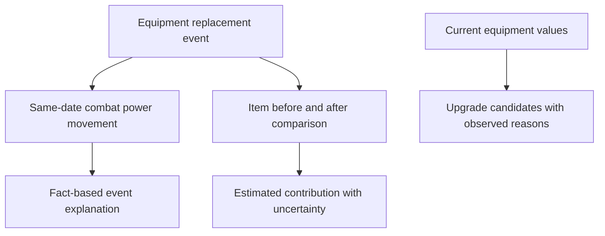

# Equipment Growth Analysis - Plan

## Goal Capsule

- **Objective:** Explain character growth through equipment changes, then identify current equipment upgrade candidates without overstating causal certainty.
- **Product authority:** This plan extends the merged growth-insights and current-equipment experiences. It owns equipment-focused growth analysis only; non-equipment metrics remain outside active scope.
- **Open blockers:** None. Planning must define the calculation method and uncertainty language for estimated combat-power contribution without changing the product boundaries below.

---

## Product Contract

### Summary

Expand each equipment-replacement timeline event into an equipment growth analysis. It will connect same-date combat-power movement, available before/after equipment attributes, and a transparent estimated contribution. It will also identify current-equipment upgrade candidates from present option, Star Force, and potential state.

### Problem Frame

The dashboard records equipment replacements and combat-power history separately. A user can see that both changed on the same day, but must infer their relationship and inspect individual item details manually.

The current equipment screen also exposes raw present values without helping the user decide which part of the build deserves attention. This leaves the core growth question unresolved: which equipment change coincided with growth, and what should the user inspect next?

### Key Decisions

- KTD1. **Equipment change is the primary growth explanation.** Show equipment-related analysis over generic period summaries. (session-settled: user-directed — chosen over amount-only, chronology-only, and generic next-step analysis: the user wants to understand equipment's relationship to growth.) Governs R1, R2, R5.
- KTD2. **Extend the existing timeline.** Keep the explanation within `ITEM_REPLACED` events instead of adding a separate summary card or screen. (session-settled: user-directed — chosen over a new dashboard card or analysis section: the event is where the change context already lives.) Governs R1, R3, R6.
- KTD3. **Combat power first.** Connect only combat-power movement in this delivery. (session-settled: user-directed — chosen over all tracked metrics or the chart-selected metric: start with the clearest equipment-related signal.) Governs R1, R4.
- KTD4. **State facts separately from estimates.** Same-date movement and estimated equipment contribution must be visually and textually distinct. (session-settled: user-approved — chosen over presenting a precise causal result: daily snapshots cannot prove exact causality.) Governs R2, R5.
- KTD5. **Keep zero and unknown distinct.** An unchanged combat-power value says “no change”; a missing comparison says it cannot be confirmed. (session-settled: user-directed — chosen over hiding the signal or treating unknown as unchanged: users need to distinguish the two states.) Governs R4, R6.
- KTD6. **Recommend from the current build.** Upgrade candidates use present equipment values rather than past change history as their primary evidence. (session-settled: user-directed — chosen over history-first recommendations: the user wants next actions based on the current build.) Governs R7, R8.
- KTD7. **Include detailed equipment comparison and guidance.** Attribute deltas and upgrade candidates are active scope rather than deferred follow-up work. (session-settled: user-directed — chosen over deferring comparison and recommendation: the user asked to include both now.) Governs R3, R5, R7.

<!-- ce-section: work-relationships -->
### How This Work Fits Together

This plan owns the equipment-focused explanation layer of the broader growth experience. The following surrounding areas remain contextual rather than active scope:

- The current equipment detail view in `docs/plans/2026-08-16-001-feat-equipment-detail-plan.md` enables present-state inspection and supplies the user context for R7.
- Non-equipment growth explanations can proceed independently after this plan establishes the equipment-analysis language and confidence boundary.
- Price, acquisition, and cost-efficiency advice remain separate product decisions; they do not follow automatically from upgrade-candidate guidance.

### Requirements

**Timeline growth context**

- R1. Each equipment-replacement event shall show the combat-power movement recorded across the same pair of snapshots as the replacement.
- R2. The event shall describe the combat-power movement as accompanying the equipment change, not as proof that the change caused the movement.
- R3. A user shall be able to inspect available before/after differences for each changed item, including item identity, options, Star Force, potential, additional potential, and other supported attributes.
- R4. The event shall distinguish positive, negative, unchanged, and uncomputable combat-power movement with accessible text.

**Comparison and estimated contribution**

- R5. When enough item and snapshot values exist, the event shall present an estimated equipment contribution with the evidence and uncertainty needed to avoid presenting it as an exact causal result.
- R6. Missing, malformed, or non-comparable equipment attributes shall remain unknown and shall not be shown as zero, unchanged, or a negative change.

**Current-build guidance**

- R7. The current equipment experience shall identify upgrade candidates from available present-state option, Star Force, potential, additional-potential, and other supported equipment values.
- R8. Each upgrade candidate shall state the observed reason it was selected and avoid claiming a guaranteed combat-power result or an objectively optimal build.

**Access and safety**

- R9. Analysis, comparison, and guidance states shall preserve the dashboard's cached-content, loading, empty, unavailable-data, and retryable-error behavior.
- R10. Timeline analysis and upgrade guidance shall remain readable on mobile and accessible without relying on color alone.
- R11. Public analysis responses shall expose only normalized values and derived explanations required for the feature; raw Nexon payloads and backend secrets remain private.

### Key Flows

- F1. Understand an equipment replacement event
  - **Trigger:** The user opens a timeline event that contains one or more equipment replacements.
  - **Steps:** The user reads the same-date combat-power movement, opens available item comparisons, and distinguishes recorded facts from an estimate.
  - **Outcome:** The user can understand what changed with the equipment and what growth was recorded alongside it.
  - **Covers:** R1, R2, R3, R4, R5, R6.

- F2. Handle incomplete comparison data
  - **Trigger:** A replacement event has no comparable combat-power values or an item omits optional attributes.
  - **Steps:** The user sees the equipment change, a clear unavailable-comparison state, and only the valid attribute comparisons.
  - **Outcome:** Missing data is not mistaken for no growth or no equipment change.
  - **Covers:** R4, R6, R9.

- F3. Find a current upgrade candidate
  - **Trigger:** The user reviews the current equipment experience.
  - **Steps:** The user sees candidates based on current available values and reads the observed reason for each recommendation.
  - **Outcome:** The user has a defensible next inspection target without being promised a guaranteed result.
  - **Covers:** R7, R8, R9, R10.

### Acceptance Examples

- AE1. Same-date movement is available
  - **Given:** An equipment replacement has comparable prior and current snapshots with combat-power values.
  - **When:** The user opens the timeline event.
  - **Then:** The event shows the signed combat-power movement as recorded alongside the replacement and labels any contribution estimate as an estimate.
  - **Covers:** R1, R2, R5.

- AE2. Detailed attribute comparison
  - **Given:** A changed weapon has different Star Force and potential values in the two snapshots.
  - **When:** The user inspects the changed item.
  - **Then:** The event shows the available before/after values and does not fabricate absent option groups.
  - **Covers:** R3, R6.

- AE3. No change versus no comparison
  - **Given:** One replacement has equal combat power across snapshots and another has a missing combat-power value.
  - **When:** The user views each event.
  - **Then:** The first says “전투력 변화 없음” and the second says “전투력 변화를 확인할 수 없음.”
  - **Covers:** R4, R6.

- AE4. Current-state upgrade guidance
  - **Given:** Current equipment contains a supported attribute pattern that makes one or more items candidates for review.
  - **When:** The user opens the current equipment experience.
  - **Then:** The product shows each candidate with its observed reason and does not promise a precise resulting combat-power gain.
  - **Covers:** R7, R8.

- AE5. Cached or unavailable data
  - **Given:** Cached dashboard data is available but a new fetch or optional analysis value fails.
  - **When:** The user opens growth analysis.
  - **Then:** Existing data remains visible, the unavailable portion is explained, and no raw payload is exposed.
  - **Covers:** R6, R9, R11.

### Scope Boundaries

#### Deferred for later

- Level, union level, HEXA matrix, EXP rate, and other non-combat-power metric connections to equipment changes.
- Price, market, acquisition, and cost-efficiency advice.
- Cross-character build ranking, shared recommendations, or account-linked personalization.

#### Outside this product's identity

- Claims that a specific equipment change definitively caused a combat-power movement.
- Guaranteed combat-power outcomes, universally optimal equipment, or prescriptive build judgments without visible evidence.

### Dependencies and Assumptions

- Daily snapshots retain the active equipment and combat-power values needed for comparison.
- Optional equipment attributes vary by item and can remain unavailable on either side of a comparison.
- The existing dashboard timeline, current equipment list, detail view, and cached-data conventions remain the primary entry points for this work.
- The product can provide transparent, evidence-based candidate guidance without attempting to reproduce every hidden in-game combat-power formula.

### Sources and Research

- `doc/brainstorm/2026-08-14-growth-insights-expansion.md` defines the existing grouped equipment replacement event and its deferred detailed comparisons.
- `docs/plans/2026-08-16-001-feat-equipment-detail-plan.md` defines the current equipment inspection contract and values-only behavior.
- `doc/api/api_contract.md` and `doc/ui/ui_states.md` define the existing dashboard response, state, and secret-exposure boundaries.

## Planning Contract

### Key Technical Decisions

- KTD8. **Enrich the generated replacement event.** Keep the existing grouped event type and add normalized combat-power context plus per-slot comparison details to its private generated detail. This preserves event ordering and idempotent recomputation while giving the frontend one source for the analysis.
- KTD9. **Use an explicit public projection.** Map the generated detail into the existing timeline response without exposing raw snapshot JSON or unsupported source fields.
- KTD10. **Keep recommendations derived from current equipment.** Produce a small list of evidence-backed candidate reasons from the existing normalized equipment view; do not add a market, cost, or account-ranking model.
- KTD11. **Treat formula limitations as product state.** If the available values cannot support a contribution estimate, return an unavailable estimate state rather than inventing a number.

### High-Level Technical Design

The backend will compare the prior and current representative snapshots when it recomputes an equipment replacement event. It will retain changed slot identity, before/after supported attributes, and same-date combat-power values in a normalized event projection. The frontend will render that projection inside the existing timeline item and show current-state upgrade candidates alongside the equipment detail experience.

The implementation should reuse the current active-equipment normalization rules, event deduplication key, dashboard response wrapper, and image/data state conventions. Comparison groups should preserve unknown values as unknown and should not interpret absent option fields as zero.

### Sequencing

1. Extend backend comparison and event-detail tests before changing the public response shape.
2. Add the current-equipment candidate projection and contract tests.
3. Render timeline comparison and candidate guidance with explicit unavailable states.
4. Update API/UI documentation and run backend, frontend, build, and browser verification.

### Risks and Dependencies

- Nexon equipment attributes vary by item type; comparison must tolerate missing groups on either side.
- The exact combat-power formula is not fully represented by the stored fields; contribution output must be labeled as estimated or unavailable.
- Recommendations can be mistaken for authoritative build advice; every candidate needs a visible reason and non-guaranteed language.

## Implementation Units

### U1. Enrich equipment replacement events

- **Goal:** Add same-date combat-power context and normalized before/after equipment attributes to grouped replacement events.
- **Requirements:** R1, R2, R3, R4, R5, R6, R11.
- **Files:** `backend/src/main/java/com/maple/growth/service/GrowthEventService.java`, `backend/src/main/java/com/maple/growth/dto/api/`, `backend/src/test/java/com/maple/growth/service/GrowthEventServiceTest.java`, `backend/src/test/java/com/maple/growth/controller/CharacterControllerTest.java`.
- **Approach:** Reuse the current slot normalization and event-key generation. Compare supported identity, Star Force, option maps, and potential strings. Store a bounded normalized projection with explicit availability and estimate state.
- **Test Scenarios:** Positive, negative, zero, and missing combat-power deltas; multiple changed slots; partial optional attributes; malformed rows; same-day recomputation idempotency; no raw payload in serialized responses.
- **Verification:** Backend unit and controller tests assert event detail keys, values-only behavior, and wrapper compatibility.

### U2. Add current-build upgrade candidates

- **Goal:** Expose evidence-backed candidate reasons from current normalized equipment values.
- **Requirements:** R7, R8, R9, R11.
- **Files:** `backend/src/main/java/com/maple/growth/service/EquipmentViewService.java`, `backend/src/main/java/com/maple/growth/dto/api/EquipmentDataDto.java`, `backend/src/main/java/com/maple/growth/dto/api/`, `backend/src/test/java/com/maple/growth/service/EquipmentViewServiceTest.java`, `doc/api/api_contract.md`.
- **Approach:** Keep candidate rules narrow and explainable. Only emit a candidate when a supported current-state signal is present; include the affected slot and observed reason, never an ungrounded optimality claim.
- **Test Scenarios:** Candidate with a supported reason; no candidate when values are absent; multiple candidates remain stable; unknown values do not trigger a candidate; unavailable equipment preserves the existing state.
- **Verification:** Backend tests cover normalized candidate output and secret/raw-payload non-exposure.

### U3. Render timeline analysis and guidance

- **Goal:** Let users inspect equipment growth context and current upgrade candidates in the existing dashboard experience.
- **Requirements:** R1, R2, R3, R4, R5, R6, R7, R8, R9, R10.
- **Files:** `frontend/components/EventTimeline.tsx`, `frontend/components/EquipmentSection.tsx`, `frontend/components/EquipmentDetailClient.tsx`, `frontend/lib/api/types.ts`, `frontend/styles/globals.css`, `frontend/__tests__/dashboard-page.test.tsx`, `frontend/scripts/e2e-regression.mjs`.
- **Approach:** Add a dedicated expandable comparison region to `ITEM_REPLACED` events and a compact current-build candidate region linked to existing equipment details. Keep the dashboard usable when analysis data is absent and preserve keyboard/mobile reading order.
- **Test Scenarios:** Event comparison renders; delta states use text; before/after values omit absent groups; estimate/unavailable labels are distinct; candidate reasons render; cached/error states preserve existing content; mobile and keyboard flow remain usable.
- **Verification:** Frontend tests, production build, and browser regression cover list-to-detail plus event analysis states.

### U4. Align contracts and finish verification

- **Goal:** Document the normalized analysis contract and prove the complete feature against the project’s release checks.
- **Requirements:** R1-R11.
- **Files:** `doc/api/api_contract.md`, `doc/ui/ui_states.md`, `frontend/__tests__/character-image-route.test.ts` only if image behavior changes, and the existing backend/frontend test suites.
- **Approach:** Document facts-versus-estimates language, unknown-value behavior, candidate guidance boundaries, and cached failure behavior without exposing raw source payloads.
- **Test Scenarios:** API wrapper shape; no secret/raw payload; existing MVP states remain unchanged; full local and CI checks pass.
- **Verification:** `cd backend && ./gradlew test`; `cd frontend && npm test`; `cd frontend && npm run build`; `cd frontend && npm run test:e2e`.

## Verification Contract

| Area | Verification | Done signal |
| --- | --- | --- |
| Backend event projection | `cd backend && ./gradlew test` | Comparison and candidate tests pass with no raw payload exposure. |
| Frontend behavior | `cd frontend && npm test` | Timeline analysis, candidate rendering, and state tests pass. |
| Production bundle | `cd frontend && npm run build` | Dashboard and equipment routes compile successfully. |
| Browser flow | `cd frontend && npm run test:e2e` | Equipment navigation and analysis states pass at desktop/mobile coverage. |
| Contract review | `git diff --check` and API/UI doc inspection | Requirements, response shape, and state language remain aligned. |

## Definition of Done

- R1-R11 are implemented or have an explicit documented unavailable state.
- Existing equipment detail and grouped replacement event behavior remains compatible.
- Contribution estimates are visibly distinguished from recorded same-date changes.
- Current-state candidates include reasons and do not promise guaranteed outcomes.
- Backend tests, frontend tests, build, browser regression, and documentation checks pass.
