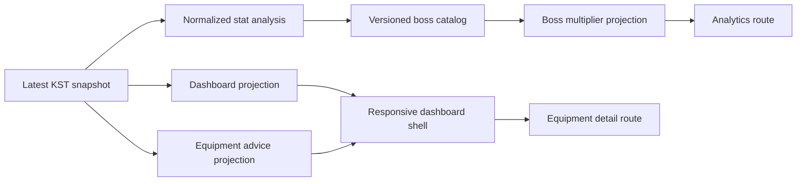

# MapleStats Dashboard and Boss Damage Analysis Plan

## Goal Capsule

- **Objective:** Recompose the character experience into the provided MapleStats-style responsive dashboard, add evidence-based combat-power improvement advice, and add a per-boss effective damage-multiplier view.
- **Product authority:** The supplied visual reference at `doc/ui/maple_growth_dashboard_mockup.jpg` defines the information hierarchy and visual direction. Existing KST snapshots, cache-first refresh behavior, anonymous search, and secret-exposure rules remain authoritative.
- **Stop conditions:** Do not invent character stats, boss values, or guaranteed damage gains. Do not expose raw Nexon JSON. Do not introduce login, account linking, boss-clear tracking, or an external data dependency for the first delivery.

---

## Product Contract

### Summary

The current dashboard has the required growth data but not the dense, analytical layout shown in the reference image. It also identifies a narrow set of equipment candidates without connecting them to a clear growth-advice surface or to boss-specific readiness.

The new experience will provide a persistent dashboard shell, a responsive three-region dashboard, a focused analysis route, evidence-based improvement advice, and a boss table that translates the latest stored boss-damage and ignore-defense values into an explicitly estimated effective damage multiplier.

### Problem Frame

Players need a compact view of their current character state, recent growth, and actionable next checks. They also need to understand how their current stat profile behaves against different boss defense values without mistaking a partial stat calculation for an in-game damage simulator.

### Requirements

**Dashboard composition**

- R1. The character dashboard shall follow the reference image's dark analytical hierarchy: navigation rail, top status area, character overview, primary growth chart, summary cards, event feed, and quick-overview cards.
- R2. The layout shall use only stored or public normalized values. A mockup value that is unavailable in the app shall show an unavailable state or be omitted, never fabricated.
- R3. The dashboard shall remain usable at mobile widths with a single-column reading order, keyboard-accessible navigation, and no color-only state meaning.
- R4. The existing first-load chart default, chart selectors, cached content during refresh, and existing equipment-detail route shall remain functional.

**Combat-power advice**

- R5. The product shall show a short, stable list of current-state combat-power improvement checks derived from available equipment and character data.
- R6. Each advice item shall identify its evidence and direct the user to the relevant equipment or analysis surface when a route exists.
- R7. Advice shall be framed as a review priority. It shall not claim a guaranteed combat-power increase, optimal build, or exact gain.
- R8. Missing or malformed optional data shall result in fewer or unavailable advice items, not zero-filled scores or inferred recommendations.

**Boss damage analysis**

- R9. A character analysis route shall list supported bosses and expose each boss's defense-rate assumption, the character's latest boss-damage and ignore-defense values, and the resulting estimated effective damage multiplier.
- R10. The multiplier shall apply the selected boss defense rate and the already-combined ignore-defense statistic. The UI shall clearly state that it excludes skills, final damage, crit, level correction, phases, buffs, party effects, and other combat variables.
- R11. A missing or unparsable required stat shall render an unavailable analysis state. It shall not be treated as `0%`.
- R12. Boss catalog values shall be versioned, deterministic, tested, and surfaced with their effective data version or last-reviewed date.
- R13. Public responses shall contain only normalized analysis inputs, assumptions, and calculated outputs. Raw Nexon stat JSON and API credentials shall remain private.

### Key Flows

- F1. Review the dashboard
  - **Trigger:** A user opens `/character/[name]`.
  - **Steps:** The user scans the overview, quick metrics, chart, summary cards, and latest events in the reference-inspired layout.
  - **Outcome:** The user can understand current state and recent growth without losing the existing refresh or chart-selector behavior.
  - **Covers:** R1, R2, R3, R4.

- F2. Follow improvement advice
  - **Trigger:** The user opens the dashboard or analysis route with available latest equipment data.
  - **Steps:** The user reads an evidence-backed advice item and follows its equipment link when one is offered.
  - **Outcome:** The user gets a concrete inspection priority without a promise of a numeric result.
  - **Covers:** R5, R6, R7, R8.

- F3. Compare boss multiplier assumptions
  - **Trigger:** The user opens `/character/[name]/analytics`.
  - **Steps:** The user selects or reads a supported boss row, sees the defense assumption and their normalized stats, then reads the estimated multiplier and its limits.
  - **Outcome:** The user can compare relative mitigation across supported bosses without treating the result as a full damage calculation.
  - **Covers:** R9, R10, R11, R12, R13.

### Acceptance Examples

- AE1. Given a latest snapshot with a profile, combat power, level, union, HEXA value, chart points, and events, when the dashboard renders at desktop width, then it presents the reference-inspired overview, central chart, summary/event region, and quick-overview region using those real values.
- AE2. Given a mobile viewport, when the same dashboard renders, then regions stack in a readable order and all navigation, chart selectors, refresh, and links remain keyboard operable.
- AE3. Given an active equipment item with a supported observable improvement signal, when advice is requested, then the API returns the item, evidence category, and review-oriented copy without an invented gain.
- AE4. Given normalized `bossDamage`, `ignoreDefense`, and a catalog boss with a known defense rate, when boss analysis is requested, then the response returns a reproducible multiplier and the catalog version.
- AE5. Given a missing `bossDamage` or `ignoreDefense` stat, when boss analysis is requested, then the response and UI identify the analysis as unavailable and do not substitute `0`.

### Scope Boundaries

#### Deferred for later

- Skills, quest, settings, and boss-clear-history pages shown only as visual inspiration in the reference image.
- Full combat simulation using skills, buff state, critical damage, final damage, level correction, party composition, phases, or rotation DPS.
- Automatic market-price, cost-efficiency, or probabilistic upgrade advice.
- Remote boss-catalog administration, scheduled catalog updates, and boss-clear recommendations.

#### Outside this product's identity

- Guaranteed combat-power increases or guaranteed boss clearability.
- Displaying synthetic HP, MP, primary stat, Arcane Force, Authentic Force, Star Force, or any other value that the stored snapshot cannot substantiate.
- Frontend calls to Nexon APIs or exposure of raw API payloads.

---

## Planning Contract

### Key Technical Decisions

- KTD1. **Use one responsive application shell.** Create a dashboard-specific shell around the existing character routes rather than duplicating navigation and top-bar markup on each page. This makes the reference hierarchy consistent while preserving Next.js route ownership.
- KTD2. **Model the reference as information hierarchy, not fake game telemetry.** Reuse profile, latest snapshot, summary, chart, timeline, and equipment data. Quick-overview cards only render supported metrics or explicit unavailable states.
- KTD3. **Keep advice deterministic and evidence-backed.** Extend the existing `EquipmentViewService` candidate pattern into a normalized advice projection. Each rule must name the observable condition that produced it and must not estimate combat-power gain.
- KTD4. **Compute boss analysis server-side from latest stored stats.** Parse only the required final-stat entries from `raw_stat_json`, project normalized values through a dedicated analysis service, and never send raw JSON to the browser.
- KTD5. **Ship a bounded, versioned local boss catalog.** Keep a reviewed catalog of supported bosses and defense assumptions in backend source/resources. This avoids a new external runtime dependency while making changes auditable and testable.
- KTD6. **Present mitigation as an estimate with explicit limits.** Apply the combined ignore-defense value to the boss defense assumption and combine that mitigation with boss-damage contribution. Name the result an effective damage multiplier, not total damage or clear prediction.

### High-Level Technical Design

The dashboard remains a cache-first projection of the latest representative KST snapshot and existing growth history. The analytics endpoint reads the same stored snapshot, normalizes only the two analysis inputs, combines them with local catalog assumptions, and returns a limited DTO for the new route.

### Multiplier Semantics

For a boss defense rate `D` and a character's already-combined ignore-defense rate `I`, calculate the remaining defense factor as `max(0, 1 - (D / 100) * (1 - I / 100))`. Multiply that factor by `(1 + bossDamage / 100)` to produce the displayed effective damage multiplier.

This is a relative stat projection, not a full MapleStory damage formula. The response must carry an explanatory limitation field and the UI must display it adjacent to the result.

### System-Wide Impact

- The dashboard API gains normalized advice only if keeping it embedded avoids an extra request; boss analysis uses a separate endpoint because it has a distinct route and catalog lifecycle.
- The snapshot sync path continues to store raw stat JSON privately. No schema migration is required for the first release.
- The character route gains shell-level navigation. Existing equipment detail and refresh flows remain within the same character context.
- Static catalog changes are product-data changes. They require a version/date update, unit tests, and documentation review.

### Risks and Mitigations

| Risk | Mitigation |
| --- | --- |
| Nexon labels or omits a final-stat entry | Centralize label matching, test known and missing shapes, and return unavailable rather than zero. |
| Boss defense assumptions become stale | Keep a versioned catalog with source and review date; do not claim live game-state accuracy. |
| Users read a multiplier as clearability | Use estimate language and list excluded combat factors in API and UI. |
| The reference image implies data the app does not collect | Render supported values only and use explicit unavailable states. |
| Dense desktop design degrades on mobile | Treat responsive layout and browser checks as feature work, not polish. |

---

## Implementation Units

### U1. Establish the MapleStats dashboard shell and responsive grid

- **Goal:** Replace the single-column dashboard composition with the reference-inspired navigation rail, top status area, desktop analytical grid, and mobile reading order.
- **Requirements:** R1, R2, R3, R4, F1, AE1, AE2.
- **Dependencies:** None.
- **Files:** `frontend/app/layout.tsx`, `frontend/app/character/[name]/page.tsx`, `frontend/components/CharacterDashboardView.tsx`, `frontend/components/ProfileHeader.tsx`, `frontend/components/SummaryCards.tsx`, `frontend/components/SyncStatus.tsx`, `frontend/styles/globals.css`, `frontend/__tests__/dashboard-page.test.tsx`, `frontend/scripts/e2e-regression.mjs`.
- **Approach:**
  1. Introduce a reusable character-context shell that owns navigation and top-bar semantics.
  2. Compose desktop regions from existing real dashboard data: overview, chart, summary/event feed, and quick metrics.
  3. Represent unavailable mockup metrics as unavailable, and keep only routes that exist or are added by this plan interactive.
  4. Define desktop, tablet, and mobile grids without duplicating dashboard content.
- **Patterns to follow:** Existing `CharacterDashboardView` state handling, `ProfileHeader` image proxy usage, `SyncStatus` refresh protection, and existing CSS custom properties.
- **Test scenarios:**
  - Render desktop dashboard regions with profile, chart, timeline, quick metric values, and no duplicate main heading.
  - Render an unavailable quick metric without a synthetic numeric value.
  - Verify navigation labels and active route are exposed to assistive technology.
  - Verify mobile order preserves overview, refresh, primary chart, advice, and event access.
  - Verify cached content remains visible while refresh is pending.
- **Verification:** Component tests cover semantic regions and unavailable states. Browser regression confirms desktop and mobile layout, image sizing, selector use, and refresh visibility.

### U2. Define normalized combat-power advice

- **Goal:** Turn current-state equipment signals into a stable, evidence-backed advice projection that can be rendered on the dashboard and analysis route.
- **Requirements:** R5, R6, R7, R8, F2, AE3.
- **Dependencies:** U1.
- **Files:** `backend/src/main/java/com/maple/growth/service/EquipmentViewService.java`, `backend/src/main/java/com/maple/growth/dto/api/EquipmentDataDto.java`, `backend/src/main/java/com/maple/growth/dto/api/EquipmentUpgradeCandidateDto.java`, `backend/src/test/java/com/maple/growth/service/EquipmentViewServiceTest.java`, `frontend/lib/api/types.ts`, `frontend/components/EquipmentSection.tsx`, `frontend/__tests__/dashboard-page.test.tsx`.
- **Approach:**
  1. Preserve the current normalized equipment projection and evolve its candidate fields only when the new advice surface needs explicit evidence or destination metadata.
  2. Keep rules narrow, ordered, and based solely on available current-state values.
  3. Link an advice item to an existing equipment detail only when its item identifier is available.
  4. Omit advice for unavailable values instead of constructing a score or default.
- **Execution note:** Start with service-level characterization tests so UI work consumes a stable normalized contract.
- **Patterns to follow:** `EquipmentViewService.candidates`, `EquipmentUpgradeCandidateDto`, and `EquipmentSection` route encoding.
- **Test scenarios:**
  - Return advice for a supported star-force or potential-grade signal with evidence text and stable ordering.
  - Do not return advice for missing, malformed, or unsupported values.
  - Do not report a numeric combat-power gain in any advice DTO or rendered copy.
  - Preserve empty equipment and unavailable-equipment states.
  - Render an advice link with an encoded equipment identifier when available.
- **Verification:** Backend tests prove deterministic advice and no raw payload projection. Frontend tests prove evidence text and safe empty states.

### U3. Add a versioned boss catalog and stat-analysis service

- **Goal:** Normalize boss-damage and ignore-defense from the latest private stat snapshot, combine them with a reviewed local boss catalog, and calculate a bounded public analysis result.
- **Requirements:** R9, R10, R11, R12, R13, F3, AE4, AE5.
- **Dependencies:** None.
- **Files:** `backend/src/main/java/com/maple/growth/service/NexonApiClient.java`, `backend/src/main/java/com/maple/growth/service/BossDamageAnalysisService.java`, `backend/src/main/java/com/maple/growth/dto/api/BossDamageAnalysisDto.java`, `backend/src/main/java/com/maple/growth/dto/api/BossMultiplierDto.java`, `backend/src/main/resources/boss-defense-catalog.json`, `backend/src/test/java/com/maple/growth/service/BossDamageAnalysisServiceTest.java`, `backend/src/test/java/com/maple/growth/service/NexonApiClientTest.java`.
- **Approach:**
  1. Reuse the final-stat array held in `DailySnapshotEntity.rawStatJson`; normalize only the required display values through one service boundary.
  2. Store boss identity, difficulty label, defense-rate assumption, catalog version, source reference, and review date in a bounded catalog file.
  3. Compute the documented multiplier only when both normalized inputs and a catalog defense rate are available.
  4. Project unavailable inputs and explanatory limits as explicit API states.
- **Patterns to follow:** `NexonApiClient.extractLongStat`, `SnapshotSyncService.buildDashboard`, existing DTO records, and `ApiResponse` wrapping.
- **Test scenarios:**
  - Parse supported Korean final-stat labels with formatted numeric text.
  - Produce the expected multiplier for representative combined ignore-defense and boss-damage values.
  - Clamp the remaining defense factor at zero when the inputs would exceed it.
  - Return unavailable when either required stat or a catalog entry is missing.
  - Serialize no raw stat JSON, raw equipment JSON, or API credentials.
  - Reject malformed catalog entries during application/test initialization.
- **Verification:** Service and API serialization tests prove formula, catalog version, unavailable state, and secret/raw-data non-exposure.

### U4. Expose the boss analysis API and analytics route

- **Goal:** Make the normalized boss projection available on a dedicated character-scoped endpoint and render it in an accessible analysis screen.
- **Requirements:** R3, R9, R10, R11, R12, R13, F3, AE4, AE5.
- **Dependencies:** U1, U3.
- **Files:** `backend/src/main/java/com/maple/growth/controller/CharacterController.java`, `backend/src/main/java/com/maple/growth/service/CharacterLookupService.java`, `backend/src/main/java/com/maple/growth/service/SnapshotSyncService.java`, `backend/src/test/java/com/maple/growth/controller/CharacterControllerTest.java`, `frontend/app/character/[name]/analytics/page.tsx`, `frontend/components/BossDamageAnalysisView.tsx`, `frontend/lib/api/client.ts`, `frontend/lib/api/types.ts`, `frontend/styles/globals.css`, `frontend/__tests__/api-client.test.tsx`, `frontend/__tests__/dashboard-page.test.tsx`, `frontend/scripts/e2e-regression.mjs`.
- **Approach:**
  1. Add a character-scoped analysis endpoint with the normal API wrapper and name encoding rules.
  2. Add an analytics route under the existing character route hierarchy and integrate it with the new shell navigation.
  3. Render a readable boss list/table with defense assumption, multiplier, normalized input stats, catalog version, and limitation copy.
  4. Preserve a full retryable error state when no analysis data exists and a limited unavailable state when only optional analysis inputs are absent.
- **Patterns to follow:** `CharacterController` endpoint validation, `fetchGrowthHistory` API client shape, `StateMessage`, and cached-content conventions in `CharacterDashboardClient`.
- **Test scenarios:**
  - Return a success wrapper for a known character with catalog metadata and ordered boss rows.
  - Return character-not-found through the existing error mapping.
  - Render the unavailable-analysis state without displaying `0%` or a fabricated multiplier.
  - Verify all data labels and the limitation are readable without color.
  - Verify analytics navigation uses an encoded character name.
  - Verify mobile rows preserve boss identity, multiplier, and assumption labels.
- **Verification:** Controller and client tests cover wrapper shape and error mapping. Browser regression covers dashboard-to-analytics navigation, desktop table, and mobile accessible layout.

### U5. Synchronize visual, domain, API, and verification documentation

- **Goal:** Make product documents match the new dashboard hierarchy, advice boundary, boss multiplier semantics, catalog ownership, and test coverage.
- **Requirements:** R1-R13.
- **Dependencies:** U1, U2, U3, U4.
- **Files:** `doc/ui/ui_states.md`, `doc/api/api_contract.md`, `doc/domain/snapshot_policy.md`, `doc/domain/growth_event_rules.md`, `README.md`, `frontend/__tests__/dashboard-page.test.tsx`, `frontend/__tests__/api-client.test.tsx`, `frontend/scripts/e2e-regression.mjs`, `backend/src/test/java/com/maple/growth/service/BossDamageAnalysisServiceTest.java`, `backend/src/test/java/com/maple/growth/controller/CharacterControllerTest.java`.
- **Approach:**
  1. Document the shell regions and responsive/accessibility states without treating the visual reference as a source of fake data.
  2. Document advice as evidence-based review guidance.
  3. Document API fields, formula limits, catalog versioning, unavailable states, and raw-data exclusion.
  4. Update smoke and regression guidance to include analytics navigation and boss-analysis states.
- **Test scenarios:**
  - Search documentation for language that promises damage, clearability, or fixed upgrades and verify it is absent.
  - Verify docs describe unavailable stat analysis as unavailable rather than zero.
  - Verify frontend and backend test suites include happy, missing-data, error, mobile, and secret-exposure coverage.
- **Verification:** Documentation and contract names match public DTOs. Backend tests, frontend tests, production build, and browser regression pass.

---

## Verification Contract

| Area | Verification | Done signal |
| --- | --- | --- |
| Dashboard shell | Frontend component tests and browser regression | Desktop and mobile regions use real data, retain interactions, and expose accessible navigation. |
| Advice projection | Backend service tests and dashboard rendering tests | Advice is deterministic, evidence-backed, routable when possible, and non-guaranteed. |
| Boss analysis | Backend service and controller tests | Formula, unavailable states, catalog versioning, validation, and non-exposure rules pass. |
| API client and route | Frontend API/client tests and browser regression | Encoded navigation and API mapping work for success, not found, unavailable, and retryable states. |
| Release check | Backend suite, frontend test suite, frontend typecheck/build, and E2E regression | No regression in search, refresh, equipment detail, chart selection, or mobile behavior. |

---

## Definition of Done

- The dashboard visibly follows the supplied MapleStats reference hierarchy on desktop and remains readable on mobile without fabricated data.
- Existing dashboard search, refresh, chart selector, timeline, equipment navigation, and image proxy behavior remain intact.
- Combat-power advice contains only observed evidence and review guidance, with no promised gain.
- The analytics route presents a versioned, test-backed boss catalog and calculated effective damage multipliers when required stats exist.
- Missing stats are explicit unavailable states, never zero-filled analysis.
- Public API responses and logs exclude raw Nexon payloads and credentials.
- Domain, API, UI, and setup documentation match the delivered behavior.
- Targeted and full backend/frontend/browser verification pass.

---

## Sources and Research

- `doc/ui/maple_growth_dashboard_mockup.jpg` - user-provided visual authority for dashboard hierarchy and style direction.
- `docs/plans/2026-08-17-001-feat-equipment-growth-analysis-plan.md` - existing evidence-based equipment candidate boundary.
- `backend/src/main/java/com/maple/growth/service/NexonApiClient.java` - existing official-stat collection and private raw-stat retention pattern.
- [NEXON Open API Maplestory character endpoints](https://openapi.nexon.com/game/maplestory/) - official character-stat endpoint availability.
- [NEXON MapleStory character information example](https://maplestory.nexon.com/Common/Character/Detail/%EB%AA%A8%EB%91%90%EC%9E%83%EC%9D%80%EB%B0%A4?p=mikO8qgdC4hElCwBGQ6GOx8CmO11EvduZkV0bRbPAhanzjW%2Byo7HhR8IoFtyY9ndOHYZPnsPNiINq77Dbyv4dqzAQnOGS%2BUsklyvaXGjc%2BdxpgkJXaFtD3Sd5xJBLCXpITWnMpfRIP3ScHavM7C8soreRP9wRlQls9%2BDqDaaRkIjRqBjS1UXhgSSgMtw%2B0la) - confirms public character display uses boss-damage and ignore-defense statistics; the implementation must still validate live Open API labels.
